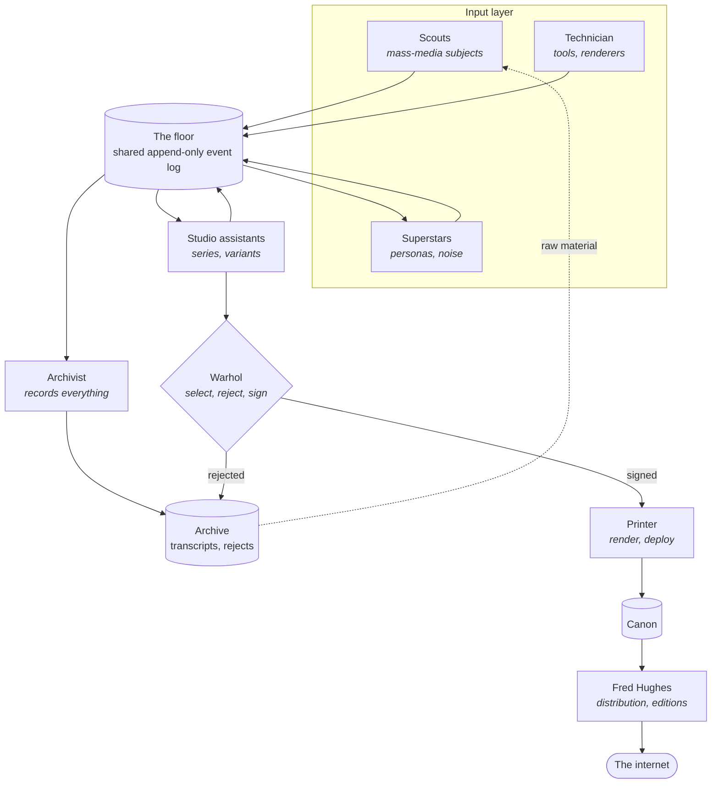
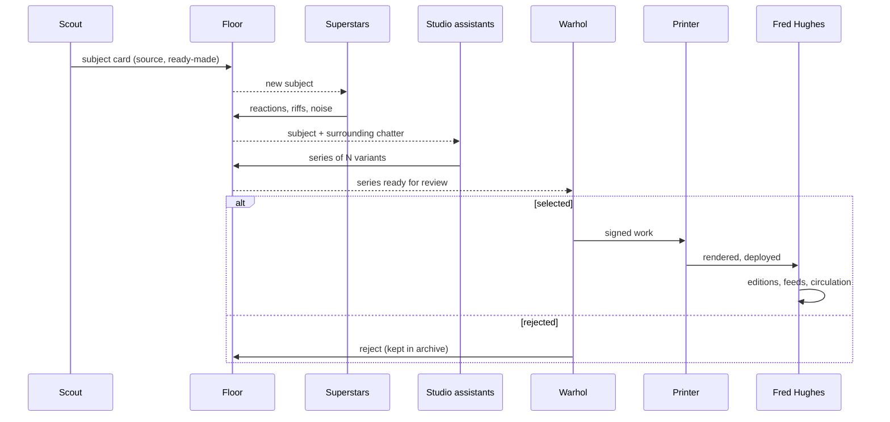

# Silver: architecture

A multi-agent setup for producing internet art, modeled on how Andy Warhol's Factory actually ran. The Factory was less a painter's atelier than a small multimedia studio: cheap, noisy, collective production upstream, and one narrow point of selection and signature downstream.

## Roles

| Agent | Factory precedent | Responsibility |
|---|---|---|
| **Scouts** | Muriel Latow, Henry Geldzahler | Pull ready-made subjects from mass media (news feeds, trending lists, Wikipedia recent changes, product catalogs) and post them as subject cards |
| **Superstars** | The "superstars", Brigid Berlin | Persona agents that react, riff, and add noise to the floor. Cast talent, not scenery |
| **Technician** | Danny Williams | Builds and maintains tools, renderers, templates, and pipelines the others use |
| **Studio assistants** | Gerard Malanga, Rupert Jasen Smith | Turn a subject card into a *series*: 10 to 50 variants across models, temperatures, and techniques |
| **Archivist** | Billy Name, Pat Hackett | Records everything: transcripts, drafts, rejects. The archive is raw material for later works |
| **Warhol** | Andy Warhol | The only gate to the canon. Selects, rejects, signs |
| **Printer** | Master printer | Renders selected works to final form and deploys them |
| **Fred Hughes** | Fred Hughes, Vincent Fremont | Distribution, editions, feeds, and circulation |

## System overview

## A work's lifecycle

## Design principles

1. **The floor is a shared, noisy bus.** Every agent can read everyone else's output, including drafts, persona chatter, and failures. Cross-contamination did most of the Factory's creative work, so it is preserved deliberately rather than routing tasks point to point.
2. **Seriality over single works.** The unit of production is a series, not a piece. Misregistration is a feature: run the same brief through different models or settings and keep the drift.
3. **Record everything.** Nothing is deleted. Transcripts and the reject pile feed back in as subjects, in the spirit of *a: A Novel*.
4. **One narrow gate.** Only the Warhol role writes to the canon. Everything upstream is cheap and disposable.
5. **Source from mass media, not imagination.** The ready-made subject is the point. Scouts find; they do not invent.
6. **Blurry roles.** Any agent may occasionally step outside its role (a superstar proposes a subject, an assistant argues with Warhol). Role boundaries are defaults, not walls.

## Floor event types (draft)

| Event | Emitted by | Payload |
|---|---|---|
| `subject.posted` | Scouts, Superstars | source URL, snapshot, why it is a ready-made |
| `chatter.posted` | Superstars | persona id, text, reference to event |
| `tool.released` | Technician | tool name, version, interface |
| `series.started` | Studio assistants | subject id, technique, model matrix |
| `variant.produced` | Studio assistants | series id, artifact path, model, params |
| `review.decision` | Warhol | series/variant id, selected or rejected, note |
| `work.published` | Printer | canon id, URL, render hash |
| `edition.released` | Fred Hughes | work id, channel, edition number |

## Decisions

Originally left open; resolved on 2026-09-23. The full list, including smaller choices, is in [ACTIONS.md](ACTIONS.md#decisions-resolved).

1. **Who is Warhol?** ~~The user, an agent with a human veto, or fully autonomous.~~ **Resolved: an agent with a human veto.** A Warhol agent shortlists and signs; nothing enters the canon until the human approves it on a local contact sheet, and each decision feeds Warhol's taste log. This is the authorship question: a Warholian reading treats delegation as authorship, while an intention-centered reading says authorship requires intention at the moment of making. The veto keeps a human intention at the point of selection while leaving the making delegated.
2. **Medium.** ~~Single-file HTML/SVG, generative pieces, or ARTX-notated works.~~ **Resolved: generative p5.js sketches**, one self-contained HTML file per variant.
3. **Runtime.** ~~OpenClaw as the gateway, or the Claude Agent SDK with the floor as a simple append-only log.~~ **Resolved: the OpenRouter API** from Node.js, so every role and every variant can run on a different model. The floor is a simple append-only JSONL log.
4. **Tempo.** ~~Continuous operation, or daily "shifts."~~ **Resolved: one daily shift**, triggered by macOS launchd.
